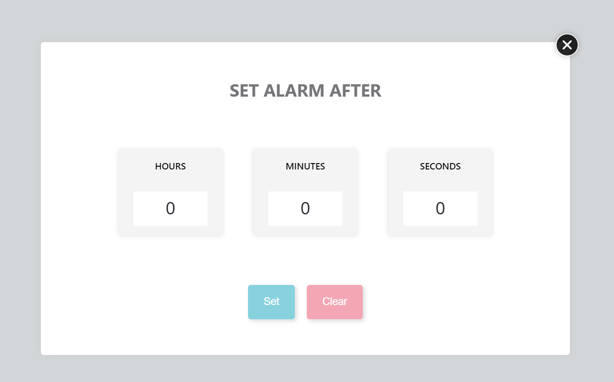

# Digital Clock & Alarm

This project is a digital clock and alarm application built using HTML, CSS, and JavaScript. The application displays the current time, day of the week, and allows users to set alarms with customizable intervals.

### Live Demo

View the live demo on GitHub Pages: [Digital Clock & Alarm Demo](https://fatmaelzahraaahmed.github.io/JS_Clock-Alarm/)

**Note: Certain features, such as fonts, may not work as expected on GitHub Pages due to restrictions. For the best experience, consider running the project locally.**

## Project Overview

## Project Structure

- **index.html:** The main HTML file containing the structure of the digital clock and alarm.
- **styles/style.css:** The CSS file responsible for styling the application.
- **assets/images/:** Directory containing image assets for the application.
- **scripts/script.js:** JavaScript file implementing the functionality of the digital clock and alarm.

## Usage

To integrate the digital clock and alarm into your project, follow these steps:

1. Copy the HTML structure from `index.html` into your project.
2. Include the provided CSS and JavaScript files.
3. Customize the application by modifying the HTML, CSS, and JavaScript code.
4. Adjust styling in the "styles/style.css" file to match your project's design.

## Features

- Display of current time with AM/PM indicator.
- Day of the week displayed.
- Set alarms with customizable intervals (hours, minutes, seconds).
- Visual representation of set alarms with a close button for removal.

Feel free to explore and enhance this project based on your requirements!
